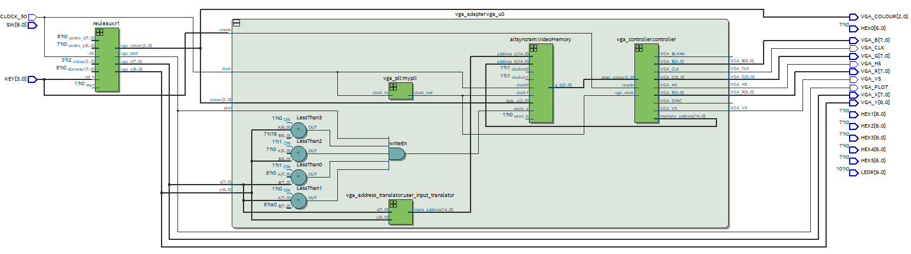

# VGA-Graphics-Controller
## Overview

The top level diagram is shown below.

Draws a [Reuleaux triangle](https://en.wikipedia.org/wiki/Reuleaux_triangle). This is a figure similar to a chubby equilateral triangle, where each triangle side is replaced by a section of a circle centred at the opposite corner:

### Bresenham Circle Algorithm

The Bresenham Circle algorithm is an integer-only circle-drawing algorithm. The basic algorithm is described in the following pseudocode (modified from Wikipedia):

    drawCircle(centre_x, centre_y, radius):
        offset_y = 0
        offset_x = radius
        crit = 1 - radius
        while offset_y ≤ offset_x:
            setPixel(centre_x + offset_x, centre_y + offset_y)   -- octant 1
            setPixel(centre_x + offset_y, centre_y + offset_x)   -- octant 2
            setPixel(centre_x - offset_x, centre_y + offset_y)   -- octant 4
            setPixel(centre_x - offset_y, centre_y + offset_x)   -- octant 3
            setPixel(centre_x - offset_x, centre_y - offset_y)   -- octant 5
            setPixel(centre_x - offset_y, centre_y - offset_x)   -- octant 6
            setPixel(centre_x + offset_x, centre_y - offset_y)   -- octant 8
            setPixel(centre_x + offset_y, centre_y - offset_x)   -- octant 7
            offset_y = offset_y + 1
            if crit ≤ 0:
                crit = crit + 2 * offset_y + 1
            else:
                offset_x = offset_x - 1
                crit = crit + 2 * (offset_y - offset_x) + 1

